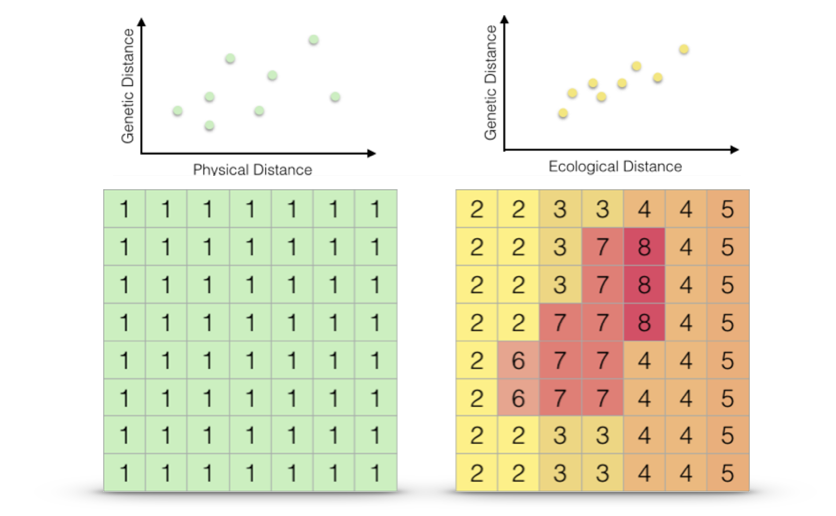
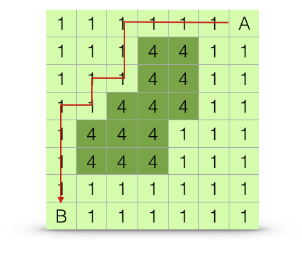

# Ecological Distance {.imageChapter}

<div class="chapter_image"></div>


Previously we have been focused on population separation in Euclidean space (e.g., physical distance).  However, populations may be functionally separated by features of the intervening landscape.  It is entirely possible that features existing between populations may influence the ability of gene flow to maintain connectivity between sites.  

```{r echo=FALSE, fig.cap="Schematics showing consequences of intervening habitat effects on connectivity.  A. Populations A and B separated in Euclidean space (black arrow) have constant resistance to connectivity (red line).  B. Populations separated by similar spatial separation (black arrow) have increased overall resistance to connectivity (red line) due to the presence of the intervening forest."}
knitr::include_graphics("./media/LandscapeResistance.png")
```

It can be argued that the *sine qua non* of applied population genetics (or landscape genetics if you like that term) is in the identification of the which subset of ecological or other features influence the connectivity of populations.  Throughout the history of population genetics, a lot of theory has been developed ignoring the effects of other organisms, the environment in which micro evolutionary processes are occurring, etc.  In the last few decades, the field has moved towards more inclusive, and site-aware, approaches and in this chapter we get into some of the ways in which you can include data available to you in both Vector (\@ref(vector-data)) and Raster (\@ref(raster-data)) formats.  

As a demonstration, we will start with the venerable `arapat` data set.  Only a subset of populations will be used for the following reasons:  

1. The mainland populations are not connected, on the reduced raster, by land.  As such, we cannot find an ecological path from those populations to the rest on the Baja Peninsula.  It is possible to connect them across the top of the Sea of Cort\'ez but that is well beyond this species natural range, making it effectively isolated.
2. Population `ESan` is located on an island and as such has no direct connection on the rasters we will be using to the remaining populations.
3. The population `165` is located in a place that the WorldClim rasters do not record land.  The rasters used have a resolution of 30-arc seconds (~1km) and this population is located at a place where that granularity of that grid does not recognize land.

```{r mapArapatCoords, message=FALSE, warning=FALSE}
library(gstudio)
library(ggrepel)
library(ggmap)
data(arapat)
data <- arapat[ !(arapat$Population %in% c("101","102","32","ESan","165")) , ]
coords <- strata_coordinates( data )
map <- population_map(coords, zoom=7)
ggmap( map ) + geom_point( aes(x=Longitude,y=Latitude),data=coords) + 
  geom_text_repel( aes(x=Longitude,y=Latitude,label=Stratum), data=coords)
```

To start with, I will use the elevation raster and modifications thereof.  The ultimate goal here is to estimate ecological separation using a variety of algorithms and as such we need to minimize the size of the background raster as much as possible.  In the code below, I take the elevation raster and create the convex hull around the population locations with a smallish buffer around the points so that the outermost populations will not be on the very edge of the data. I further constrain this raster by cutting regions within which we have no evidence that the target species exist, in this case we have almost no records of it occurring above 700m.

```{r eco-convex-hull, warning=FALSE, message=FALSE}
library(rgeos) 
library(raster)
alt <- raster("./spatial_data/alt.tif")
baja_pts <- SpatialPoints( coords[,2:3])
hull <- gConvexHull(baja_pts)
hull_plus_buffer <- gBuffer(hull,width=.2)
alt <- trim( mask( alt, hull_plus_buffer))
alt[ alt > 700 ] <- NA
plot(alt, xlab="Longitude", ylab="Latitude")
```

To start with, we should probably examine the distribution of the variable we are working with in the locations at which the samples are taken.

```{r elevation}
coords$elevation <- extract( alt, coords[,2:3])
ggplot( coords, aes(x=elevation)) + geom_histogram( binwidth = 25 ) + 
  xlab("Elevation (m)") + ylab("Frequency")
```

We can compare this against the 'background' values that we find across the raster, even in places where our samples were not taken.  Deviations observed in the distribution of values sampled from our sites from that defined in the background suggest that our sampling was not entirely random see \@ref(niche-modeling) for a more complete discussion on how to evaluate the relative importance of particular background features in the distribution of your organism.

```{r}
s <- values( alt )
s <- s[ !is.na(s) ]
Category <- c(rep("Observed",nrow(coords)), rep("Background",length(s)))
Elevation <- c(coords$elevation, s)
df <- data.frame( Category,Elevation)
ggplot( df, aes(x=Elevation,fill=Category)) + geom_density( alpha=0.75 ) +  
  xlab("Elevation (m)") + ylab("Frequency")

```


## The Concept of Resistance

The way in which the intervening habitat may influence genetic connectivity can be both varied and complex.  In R we quantify spatial data using a `raster` format.  As discussed in \@ref(raster-data), a raster is essentially a matrix whose entries represent some value that has both spatial location and extent. 

```{r echo=FALSE, fig.cap="Example raster representing a landscape with two different habitat types on it (light and dark)."}
knitr::include_graphics("./media/RasterGrid.png")
```

Several approaches are available to parameterizing a cost surface.  These range from expert opinion (where someones opinion fills in the gaps), to externally defined variables, to approaches that consider entire ranges of resistance.

```{r parameterizedRaster, echo=FALSE, fig.cap="Dichotomous cost surface containing two features, one four times more difficult to traverse than the other."}
knitr::include_graphics("./media/RasterGridParameterized.png")
```

Independent of how the values are set (though this is a huge component which can be addressed outside the context of how this is done), the raster (as in Figure \@ref(fig:parameterizedRaster)) can be considered as a component of a potential hypothesis.  It is not a complete hypothesis because we must first decide how distances on that raster are estimated---the result of which will be the complete hypothesis.  We return to ways in which distances can be estimated below (\@ref(estimating-separation)).

```{r echo=FALSE, fig.cap="Individual resistance surfaces may be combined to produce interaction (multivariate) cost distance surfaces.  In this example, the categorial surface (left) is combined with a cost sufrace representing a cline (center raster) to produce via the addition operator a surface representing both (right)."}
knitr::include_graphics("./media/MultivariateCostRaster.png")
```


Once we have a set of cost surfaces defined, our goal is to determine if there are subsets which help to explain the observed genetic structure we find on the landscape (Figure \@ref(fig:EuclVsEcol)).

```{r EuclVsEcol, echo=FALSE, fig.cap="Two different cost surfaces, Euclidean distance (left) and the multivariate ecological distance derived perviously (right).  The extent to which each of these resistance hypotheses can explain the observed genetic distances (graphs over top"}

```

No matter how we actually measure separation, we can think of cost surfaces as belonging to one of two mutually exclusive categories; absolute resistance and relative resistance.  Absolute resistance is invariant to source and destination whereas relative landscape resistance is depending upon starting location.


### Absolute Resistance

Absolute resistance is the condition by which landscape features provide an invariable source of resistance to movement.  Examples here may include physical barriers that exert the same magnitude of resistance to movement no matter where the initial and destination locations are found.  For example, in an urban environment, a building provides an absolute resistance with respect to plant pollinators---they cannot move through that object no matter which direction they are coming from.  

In the example below, I will use the slope of the terrain as a example under the assumption that there a level of steepness of the terrain that prevents movement of individuals between locales. It does not matter at which direction the organism approaches this steep part of the landscape (uphill, downhill, or cross slope), their movement is restricted in a uniform manner. 

```{r echo=-1}
slope <- terrain(alt, unit='degrees')
plot(slope)
plot(baja_pts,add=T)
```

If we look at the distribution of slope values we can see the vast majority of the lower part of Baja California has a rather gentle slope.  

```{r distribution-of-slope, fig.cap="Distribution of estimates for slope (in degrees) across all pixels in the altitude raster."}
df <- data.frame( rasterToPoints(slope))
ggplot( df, aes(x=slope)) + geom_histogram( binwidth=0.1) + 
  xlab("Slope (degrees)") + ylab("Frequency")
```

In the following examples, I'm going to use the distribution of values shown in Figure \@ref(fig:distribution-of-slope).  


```{block, note-slope-scale, type='comment_information'}
It is very important to note that the slope we are deriving here is based upon an average across a 30-arc second pixel size in the desert.  We are perhaps missing a lot of sub-kilometer slop-y areas that prevent movement.  However, this is an example meant more for the importance of providing the methodology of how you would do this than an expectation explaining biological relevance.
```

For the purposes of this example, I'll define three categories of slope.  The values returned by the `terrain()` function in this case are in degrees (though radians and tangent are also possible, see `?terrain`).  A new raster will be created, based slope, with the following (somewhat arbitrary but relevant as an example) categories:  

- Slope < 5$^{\circ}$ has no effect on movement.
- Slope at a location between 5$^{\circ}$ and 10$^{\circ}$ result in a movement resistance twice as difficult as the low/no slope condition.
- Slope in excess of 10$^{\circ}$ is categorized as four times as difficult for movement than the low/no slope areas on the map.


```{r}
tmp <- slope
tmp[ slope < 5 ] <- 1
tmp[ slope > 5 ] <- 2
tmp[ slope > 10 ] <- 4
cat_slope <- ratify(tmp, count=TRUE)
rat <- levels( cat_slope )[[1]]
rat$Slope_Type <- c("None","Low","High")
levels(cat_slope) <- rat 
cat_slope
```

For this raster, I set up the categories and define a *raster attribute table* (see \@ref(categorical-rasters)) to make the output more legible.  If we visualize this raster, we see the landscape partitioned into these three categories. 

```{r}
plot(cat_slope, legend=FALSE)
```

From here, we can proceed to estimating distances among points.  This absolute cost surface is just one example.  You could have used the raw value of slope (larger linearly becoming more difficult), a function of slope, or any variant of coming up with a metric to create the values in each pixel.  The point here is that this is an absolute cost, and all estimates of distance, independent of origin and destination, use the same cost raster.


## Relative Resistance

The other way in which rasters may be created are are based upon relative cost distances.  These cost surfaces are created, relative to some particular benchmark point on the surface.  For example, if you think that phenology (e.g., the timing of reproduction) may be an important component contributing to connectivity among populations (as is the case for plant species), it is not the absolute value of elevation that is of concern across the landscape.  Rather it is the similarity in elevation that is the driver---plant populations at the same elevations may tend to flower in higher synchrony than those separated across elevation gradients.  As such, when we estimate cost surfaces for something like this, we would focus on on the magnitude of elevation but on the absolute difference in elevation between points.  Under this *relative* cost approach, the distance from each locale would be based upon the deviance in elevation from that point to the rest of the landscape.  

I'll use this concept of elevation similarity in this example, starting with the elevation of population `163`, which will be the benchmark.

```{r}
idx <- which( coords$Stratum == "163")
target_elevation <- coords$elevation[ idx ]
target_elevation
```

From this target elevation, we can create an elevation raster that is based upon the deviation between the benchmark and everyone else.  Since this is a cost surface we are creating we need to perhaps include a base cost instead of having elevation clines with zero resistance.  For this, I add a unit cost to the entire raster.

```{r}
tmp <- alt - target_elevation
tmp <- abs( tmp ) + 1
plot( tmp )
```

For subsequent analyse, the distance between this specific locale and the remaining can be estimated using this raster.  However, if we are to move to the next population, the distance between that locale and this one would need to be based on a new elevation benchmark.  This means that for $K$ populations, pairwise estimates of relative distance need to be estimated from $K$ different rasters^[Assuming of course that each of your $K$ locale are at a unique elevation, if some are at the same elevation then the derived rasters will be identical.]!  


## Estimating Separation

Once we have defined one or more rasters quantifying resistance costs, we can go and estimate the distance among points on those rasters.  There are several ways available for us to estimate distance.  The differences in these methods are based upon the algorithm used to estimate separation and the extent of the raster used to apply these algorithms.

### Least Cost Distance

A least cost path is the route between two points, say $A \to B$, whose measured cost is minimal.  This is the *optimal* route across the landscape.  Organisms or vectors of gene exchange may, or may not, move across a landscape following an *optimal* path.  An example shortest path is shown in Figure \@ref(fig:lcp-example).

```{r lcp-example, echo=FALSE, fig.cap="Estimation algorithm for least-cost path distance.  The path chosen is the one with the shortest overall distance, or at least one of the paths with equally short overall distances."}

```

One way to estimate distances in R, is through the use of the `gdistance` library.  In this approach, we define a transition object based upon:  
1. The cost distance raster.  By default, the `transition()` function works on conductance, which is the inverse of resistance.  In these examples, we have used a single raster, though use of *RasterBrick* objects is just as appropriate.
2. The function by which we estimate the pixel-to-pixel distances.  
3. The neighborhood around each pixel that we look at during each step.  Options for this include:  
  - A von Neumann neighborhood (`directions=4`) consists of the pixels immediately above, below, and on both sides of the target pixel.  
  - A Moore's neighborhood (`directions=8`) consisting of all pixels surrounding the target pixel (e.g., even the diagonal ones)
  - A Knight & One-Cell Queen move (`directions=16`), which adds the next layer of cells outside of Moore's neighborhood.

Once estimated, the transition object *must* be corrected for if you are either using a large extent based upon Latitude and Longitude datum (e.g., they are not unit-wise consistent in area), or you have used a `direction` option other than the von Neuman Neighborhood.

In the example below, I use the cost distance estimated based upon similarity in elevation, under the hypothesis that phenological synchrony may influence connectivity.

```{r message=FALSE, warning=FALSE}
library(gdistance)
tr <- transition( 1/tmp, transitionFunction = mean, directions = 4 )
tr <- geoCorrection( tr, type="c", multpl=FALSE, scl=FALSE)
tr
```

From this, potentially corrected, transition object we can estimate shortest path distance using the aptly named function `shortestPath()`, passing it the transition object, the point from which we are starting, and the destination, and an optional parameter on how we want the output returned.  In the example below, the results is returned as a *SpatialLines* object which I use to plot.

```{r}
path.1 <- shortestPath( tr, baja_pts[26], baja_pts[15], output="SpatialLines")
plot( tmp , xlab="Longitude", ylab="Latitude")
lines( path.1, col="red")
points( coords[c(26,15),2:3],pch=16, col="red")
```

As explained above, relative cost distances may create asymmetric distances.  If the shortest path between the two populations is taken in the opposite direction, we get different shortest path across the landscape.

```{r}
tmp <- alt
tmp <- abs( tmp - coords$elevation[ 15 ] ) + 1
tr <- transition( 1/tmp, transitionFunction = mean, directions = 4 )
tr <- geoCorrection( tr, type="r", multpl=FALSE, scl=FALSE)
path.2 <- shortestPath(tr,baja_pts[15],baja_pts[26],output="SpatialLines")
plot( alt , xlab="Longitude", ylab="Latitude")
lines( path.1, col="red")
lines( path.2, col="blue")
points( coords[c(26,15),2:3],pch=16, col="red")
```

Not only is it a different path, they are also different lengths.

```{r}
c( SpatialLinesLengths( path.1 ), SpatialLinesLengths( path.2 ) )
```


### All Paths (Circuit) Distance

Organisms may not move in an *optimal* way across the landscape but may move along several different paths, most of which are *unoptimal*.  The relative proportion of these alternative paths and their lengths may be combined to produce a distance between sites based upon all potential paths, $A \Rightarrow B$.  In the context of genetic connectivity, this method is referred to by the name of one of the software packages available to estimate it, [Circuitscape](http://circuitscape.org) by McRae (2006).  An example is shown in Figure \@ref(fig:ct-example).

```{r ct-example, echo=FALSE, fig.cap="Estimation algorithm for all-paths (circuit) distance.  The estimated distance between points $A$ and $B$ is based upon the length and relative frequencies of all potential paths across the landscape, even thouse that traverse more resistant portions of the landscape (highlighted in yellow)."}
knitr::include_graphics("./media/CT.png")
```

Using as an example, you can apply this algorithm to the resistance surface based upon relative deviation from population 93 (as in the last example). Since this method uses *all* paths that leave the the target site and can arrive at the destination location, you cannot produce a single path example.  What you do get from it is a spatial current raster from that site (e.g., the spatial flow away from it) as shown in Figure \@ref(fig:circuitscape-from-93). 

```{r circuitscape-from-93, echo=FALSE, fig.cap="Estimation of current map based upon relative cost distance from conditions observed at site 93.", echo=-(2:3)}
r <- raster("media/Baja_Out_curmap_15.asc")
plot( log10(r), legend=FALSE, xlab="Longitude", ylab="Latitude" )
plot( baja_pts[15], add=TRUE )
```


### Path & Corridor Constraints

Both least-cost, and all-paths approaches consider the entire cost surface in the estimation of distances. This is a *very important* point that needs to be made to emphasize some of the constraints that may be imposed on your actual estimation process.  

These approaches use graph-theoretic algorithms to estimate the length of various paths across the cost surface.  To do this, each pixel is treated as a node in a network, only after which the length of the paths may be estimated.  This is why it is important to limit the potential size of your background cost raster to an area that includes your sampling sites but not regions through which connectivity will not traverse.  For example, there is a very large number of paths that exist outside the convex hull displayed in Figure \@ref(fig:eco-convex-hull), the overwhelming majority of which have absolutely no influence on connectivity among the sites we are interested in studying.  If you do not restrict the cost raster as we did, the extra pixels are added network that needs to be constructed to estimate distance, independent of the fact that they may not be a member of the shortest (or even not longest) paths contributing to connectivity.  Numerically, algorithms such as Dijkstra'a (one for finding the single shortest path), scale in time with the number of nodes as show below (Figure \@ref(fig:dijkstra-time)).  

```{r dijkstra-time, echo=FALSE}
minNodes <- 2
maxNodes <- 100
stepNodes <- 2
v <- seq(minNodes,maxNodes,by=stepNodes)
e <- v* (v-1)/2
df <- data.frame( Pixels=v, Time=e+v*log10(v))
ggplot(df, aes(Pixels,Time)) + geom_line() + geom_point() + xlab("Number of Pixels in Raster") + ylab("Time Complexity")
```

Computer scientists use the notion of time complexity, a measure defined as the number of steps in the code required to complete the task.  This algorithm is described as $O(|e| + |v| \log |v|$, where $|e|$ is the number of edges and $|v|$ is the number of nodes.  In our example, the number of nodes, $|v|$ is how many pixels are in the landscape and the number of edges is $|v|(|v|-1)/2$!  This gets big quickly so anything you can do to limit the number of potential pixels in your landscape is important.

In addition to limiting the size of the raster outside your study area, one can also limit the intervening areas by imposing some constraints on where these paths may be found.  A common approach here is to define corridors between sites.  These corridors have a restricted width through which these paths may traverse (or at least through which the algorithms may look for these paths).  The width of these corridors may be either defined *a priori* or determined as a component of the analysis itself.


## Estimating Correlations in Distance

In the end, we are interested in getting to the pairwise distances among all sites, we extend the paths approaches as we outlined above.  For these examples, I'll use the categorical slope example and use both the least cost and the all-paths approaches.  Here is the raster.

```{r fig.cap="Cost raster for elevation based upon slope categories across regions for all peninsular Baja California populations.", echo=FALSE}
plot(cat_slope, legend=FALSE, xlab="Longitude",ylab="Latitude", 
     main="Categorical Slope Resistance")
plot( baja_pts, add=TRUE )
```


### Pairwise Least Cost Path 

For the least cost approach, we need to grab the transition objects and perform a `geoCorrection` because we are using Longitude & Latitude based coordinates.

```{r}
tr <- transition( 1/cat_slope, transitionFunction = mean, directions = 4 )
tr <- geoCorrection( tr, type="c", multpl=FALSE, scl=FALSE)
```

The corrected transition object can be used to estimate the shortest paths among all points using the `costDistance()` function.

```{r}
eDist <- costDistance( tr, baja_pts )
eDist <- as.matrix( eDist )
rownames(eDist) <- colnames(eDist) <- coords$Stratum
eDist[1:10,1:10] 
```

This returns a `dist` object, which I translate into a matrix and you can plot the corresponding relationship with genetic distance (I'll use Nei's distance as the example).

```{r}
gDist <- genetic_distance(data,stratum="Population", mode="nei")
df <- data.frame( Genetic_Distance = gDist[lower.tri(gDist)],
                  Slope_Distance = eDist[ lower.tri(eDist)])
df <- df[ !is.infinite(df$Slope_Distance),]
ggplot(df,aes(x=Slope_Distance,y=Genetic_Distance)) + geom_point() + 
  stat_smooth(method=lm, formula = y ~ x) + xlab("Least Cost Distance (Slope Categories)") + ylab("Neis Distance")
```


From these data, we can estimate the correlation (a rough estimate).

```{r}
cor(df$Genetic_Distance, df$Slope_Distance)
```

As we see, it is not a very large correlation.  If we were to attempt to ascertain significance for these values, we would want to use a `mantel()` approach rather than one using a normal Pearson approximation for significance due to the lack of independence.  However, there is no real need to test significance here since the correlation is so small, even if this was significantly different than zero the biological consequences are minimal.


### Pairwise All Pairs 

For an all-pairs (circuit) approach, you can do it in R or use the [Circuitscape](http://www.circuitscape.org) software.  I'll use the latter approach and illustrate the process so that I can demonstrate how you could produce the required input file formats.  The input required for Circuitscape consist of a resistance raster and the coordinates of all the sites.  For the cost raster, you can write it using `writeRaster()`.  An easy input format for both this raster and the coordinates is that of an ASCII raster.  Here is how the cost distance is exported to files.

```{r eval=FALSE}
writeRaster( cat_slope, filename="CategoricalSlope.asc")
```

And the sites can be done as well in ASCII raster format as by using the `rasterize()` function turning a set of points into a raster with the same extent as the raster you passed.

```{r eval=FALSE}
sites <- resterize(baja_pts, cat_slope )
writeRaster(sites,filename="sites.asc")
```

These are input directly into the Circuitscape input. The output from the analysis is presented as a set of columns in a text file (row, col, resistance).  Using the same input data as above produced the following:

```{r}
data <- read.table("media/BajaParwise_resistances_3columns",header=FALSE, sep=" ")
ctDist <- matrix(0,nrow=34,ncol=34)
for( i in 1:nrow(data)){
  ctDist[ data$V1[i], data$V2[i] ] <- data$V3[i]
}
ctDist <- ctDist + t(ctDist)
ctDist[1:5,1:5]
```

Pairs of points that are unreachable are encoded as -1, I'll change that to `NA`.

```{r}
ctDist[ ctDist == -1 ] <- NA
ctDist[ is.infinite(ctDist)] <- NA
ctDist[1:5,1:5]
```

As before, we can plot these against each other.

```{r}
df1 <- data.frame( Genetic_Distance = gDist[ lower.tri(gDist) ],
                  Circuit_Distance = ctDist[ lower.tri(ctDist)])
df1 <- df1[ !is.na(df1$Circuit_Distance),]
ggplot(df1,aes(x=Circuit_Distance,y=Genetic_Distance)) + geom_point() + 
  stat_smooth(method=lm, formula = y ~ x) + xlab("Circuit Distance (Slope)") + ylab("Nei's Genetic Distance")
```

If you do these analyses in R using `gdistance`, you need to adjust the arguments to both `transition` and `geoCorrection` for using an all-paths approach (see the documentation on these functions) and you can get pairwise distances from the `commuteDistance()` function.

```{r}
cor( df1$Genetic_Distance, df1$Circuit_Distance )
```

#### Similarity in Outcome

A pertinent question revolves around the extent to which 

```{r}
data <- data.frame(Slope=df$Slope_Distance, Circuit=df1$Circuit_Distance )
ggplot(data,aes(x=Slope,y=Circuit)) + geom_point() + 
  stat_smooth() + xlab("Least Cost Distance") + ylab("Circuit Distance")
```


As a first pass, we can look at the magnitude of these distance estimates.

```{r}
cor.test(data$Slope, data$Circuit, method = "spearman")
```


