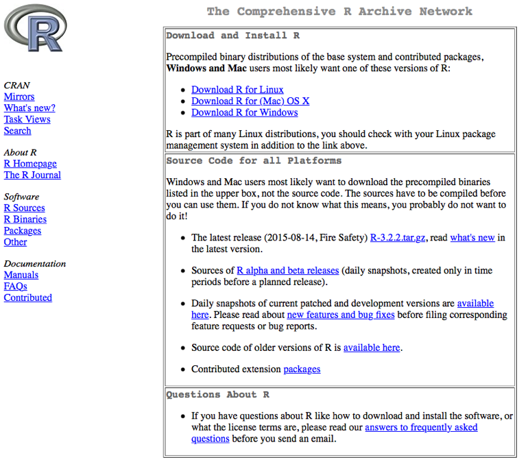
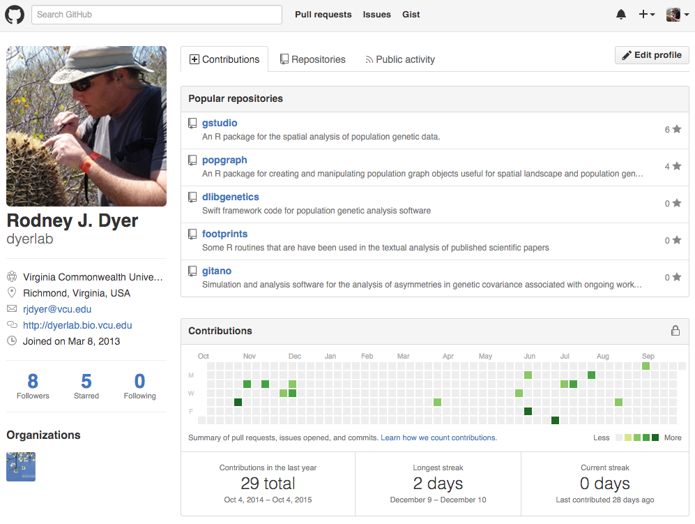

# The R Ecosystem {.imageChapter}

<iframe class="chapter_image" width="640" height="360" src="https://www.youtube.com/embed/Xz5EgzV2S58?list=PLjvIGgJ_mgVokdI-r7q_erREHi-DGnGSq" frameborder="0" allowfullscreen></iframe>

> R is an open-source, community driven platform available for a wide variety of computer operating systems and is becoming a de facto standard in modern biological analyses.  It is not a point-and-click interface, rather it is a rich analytical ecosystem that will make your research and scientific life more pleasurable.

## Getting R Configured

The grammar of the R language was derived from another system called S-Plus.  S-Plus was a proprietary analysis platform developed by AT&T and licenses were sold for its use, mostly in industry and education.  The development of R was initiated by `XXXX` and `XXX`, whose goal was to create an interpreter that could read grammar similar to S-Plus but be available to the larger education community.   The use of R has increased dramatically due to its open nature and the ability of people to share code solutions with relatively little barriers.

The main repository for R is located at the [CRAN Repository](http://cran.r-project.org), which is where you can download the latest version.  It is in your best interests to make sure you update the underlying R system, changes are made continually (perhaps despite the outward appearance of the website).  

```{r echo=FALSE}

```

The current version of this book uses version 3.2.  To get the correct version, open the page and there should be a link at the top for your particular computing platform. Download the appropriate version and install it following the instructions appropriate for your computer.

### Packages

The base R system comes with enough functionality to get you going.  By default, there is only a limited amount of functionality in R, which is a great thing.  You only load and use the packages that you intend to use.  There are just too many packages to have them all loaded into memory at all times and there is such a broad range of packages, it is not likely you'd need more than a small fraction of the packages during the course of all your analyses.
Once you have a package, you can tell R that you intend to use it by either

```{r eval=FALSE}
library(package_name)
```

or

```{r eval=FALSE}
library(package_name)
```

They are approximately equivalent, differing in only that the second one actually returns a TRUE or FALSE indicating the presence of that library on you machine.  I prefer the later and use it throughout.  

There are, at present, a few different places you can get packages. The packages can either be downloaded from these online repositories and installed into R or you can install them from within R itself.  Again, I'll prefer the latter as it is a bit more straightforward.   

### CRAN

The main repository for packages is hosted by the r-project page itself.  There are packages with solutions to analyses ranging from Approximate Bayesian Computation to Zhang & Pilon's approaches to characterizing climatic trends.  The list of these packages is large and ever growing.  It can be found on CRAN under the packages menu. To install a package from this repository, you use the function 

```{r eval=FALSE}
install.packages("thePackageName") 
```

You can see that R went to the CRAN mirror site (I use the rstudio one), downloaded the package, look for particular dependencies that that package may have and download them as well for you.  It should install these packages for you and give you an affirmative message indicating it had done so.  

At times, there are some packages that are not available in binary form for all computer systems (the rgdal package is one that comes to mind for which we will provide a work around later) and the packages need to be compiled.  This means that you need to have some additional tools and/or libraries on your machine to take the code, compile it, and link it together to make the package.  In these cases, the internet and the documentation that the developer provide are key to your sanity.

### GitHub

There are an increasing number of projects that are being developed either in the open source community or shared among a set of developers.  These projects are often hosted on http://www.github.com where you can get access to the latest code updates.  The packages that I develop are hosted on Github at (http://github.com/dyerlab) and only pushed to CRAN when I make major changes. 

```{r echo=FALSE}

```


To install packages from Github you need to install the devtools library from CRAN first

```{r eval=FALSE}
install.packages("devtools")
library(devtools)
```

Then you need to use the devtools function `install_github()` to go grab it.  To do so you need two separate pieces of information, the name of the developer who is creating the repository and the name of the repository it is contained within.  For the gstudio package, the develop is dyerlab and the repository name is gstudio. If you are comfortable with git, you can also check out certain branches of development if you like with optional arguments to the `install_github()` function.  

If you are starting to work with R and intend to compile packages, there are some tools that you will need to have on your machine.  For Windows machines, there is an rtools download EXE that you can get.  On OSX, you need to download the developers tools from Apple (available on the Application Store for free).  In either case, the developer (if they care about their code being used by others) should provide sufficient documentation.

### Bioconductor

The last main location to find packages is on the Bioconductor site, a collection of software for bioinformatic analyses.  To install from the bioconductor site you need to download their own installer as:

```{r eval=FALSE}
source("http://bioconductor.org/biocLite.R")
biocLite()
```

And then to install packages you use 

```{r eval=FALSE}
biocLite(c("GenomicFeatures", "AnnotationDbi"))
```


There are no libraries used in this text from bioconductor as this text is more focused on marker-based population genetics and not sequences, annotations, etc. 

### Troublesome Packages

Some packages provide a unique set of problems for getting them onto your computer.  There are a variety of reasons for this and Google is your friend (though it would be easier if R was named something more unique than the 18th letter of the alphabet...). 

#### RGDAL & RGEOS {#rgdal-rgeos-packages}

Every time I upgrade in any significant way, two R libraries seem to raise their ugly heads and scream like a spoiled child—rgdal and rgeos.  Why do these two have to be SOOOO much of a pain? Why can't we have a auto build of a binary with all the options in it for OSX? Who knows? I always feel like I get the fuzzy end of the lollipop with these two. Here is my latest approach for getting them going.

First you have to make sure you have the latest GDAL libraries. I used to get mine from [Kyngchaos](http://www.kyngchaos.com/software/frameworks), just download the framework, install it, and then do some kind of long R CMD INSTALL dance, which seems to no longer work for me. I also tried installing from Ripley's repository and found that (a) It was a version older than the one I already had on my machine, and (b) you can't install from that repository, there is a malformed header and the install.packages() function just barfs.

Time to try something new. I typically stay away from the various installer frameworks out there on OSX to keep everything in Frameworks. But this time, I used MacPorts. You can find the latest version here. Here is how I got it to help me out.  

- Download XCode from Apple, it is both free and has a lot of tools that make your life as a programmer easier.  It is a big package and you'll have to install the command line developer tools as well.  You will be prompted on how to do this.
- Downloaded the version of macports for your OS, I'm currently on 10.11 and installed it with little problems.  It takes a bit of time at the end of the installation because it is downloading a lot of information.  Be patient. 
- In the terminal, I updated it `sudo ports -v selfupdate` and again be patient, it is going to grab a lot of stuff from the internet.
- I then used it to install `gdal` as a unix library (rather than as a framework so it won't be located in /Library/Frameworks) by sudo ports install `gdal`. There were a lot of dependencies for this one so it took a while.
- I then had R install rgdal as `install.packages( rgdal, type="source")`

Worked like a charm.


## Libraries Used in Text

This work requires several libraries that you may need to get from either CRAN or GitHub. The following if you run the following code, you should be up-to-date on the necessary packages used throughout this text.

```{r echo=FALSE, warning=FALSE}
files <- list.files(".",pattern=".rmd")
libraries <- c("gstudio","popgraph","ggplot2")
for( file in files ) {
  s <- system( paste("grep -E -o 'require\\(\\w+\\)'",file), intern=TRUE)
  if( length(s) > 0 ) {
    s <- strsplit(s,"(",fixed=TRUE)
    for( item in s ){
      if( length(item) == 2){
        library <- strsplit(item[2],")",fixed=TRUE)[[1]]
        libraries <- c(libraries,library)
      }
    }
  }
}
pkgs <- sort( unique(libraries) )
idx <- which( pkgs == "package_name" )
pkgs <- pkgs[-idx]
pkgs_df = data.frame(Name = pkgs, Title = NA)
for(i in seq_along(pkgs)){
  f = system.file(package = pkgs[i], "DESCRIPTION")
  if( nchar(f)> 1) {
    # Title is always on 3rd line
    title = readLines(f)
    title = title[grep("Title: ", title)]
    pkgs_df$Title[i] = gsub("Title: ", "", title)    
  }
}
knitr::kable(pkgs_df,caption = "R packages used in the examples shown in this book.")
```


## The RStudio Environment

By itself, R can be used in the terminal or as the basic interface the installer provides.  While both of these methods are sufficient for working in R, they are less than optimal (IMHO).  I believe one of the most important tools you can use is a good IDE as it helps you organize and work with your data in ways that focus more on the outcome and less on the implementation.  I've spent a lot of time in both Emacs and Vim and while they may be tools for the geek elite, RStudio has made me much more productive in terms of output per unit time.

```{r echo=FALSE}
knitr::include_graphics("./media/RStudioIDE.png")
```

The RStudio IDE can be can be downloaded directly from http://rstudio.org and comes in varieties for desktops and servers.  The packages are easy to install and contain all the instructions you need.  If you run your own server, you can install it and do your analyses via a web interface that looks identical to the desktop client (in fact it is more similar than you perhaps know).  

The interface has four panes, two of which (the source code editor and the terminal output) you will work with the most often.  The other panes have information on the history of your project, plot output, packages, help, and a file browser.  You can type in R commands in the terminal window and receive responses directly, just as normal.  However, you can also type in your code into a script file (files ending in *.R) and run them directly.  You can also create Markdown and LaTeX documents embedding your code in with the verbiage, which is evaluated any time you make a html, rtf, docx, or pdf output.  All the code from R for this book was written in RMarkdown and parsed as an html document.  If you are a serious user of R, you can use LaTeX or RMarkdown to make documents, slides, presentations, posters, etc.  It is a versatile tool and one worth looking into, especially as it pertains to reproducible research (something we all need to strive for).


